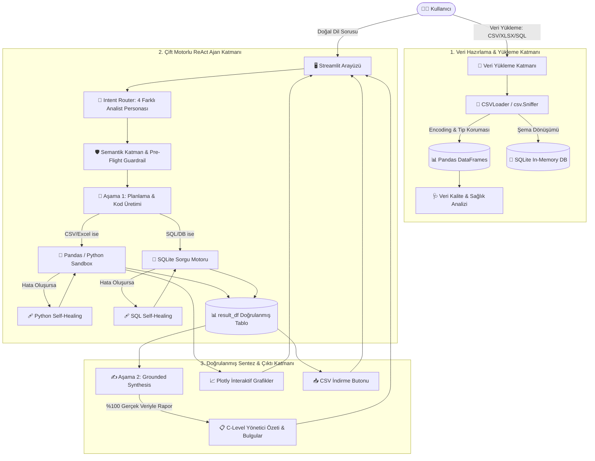
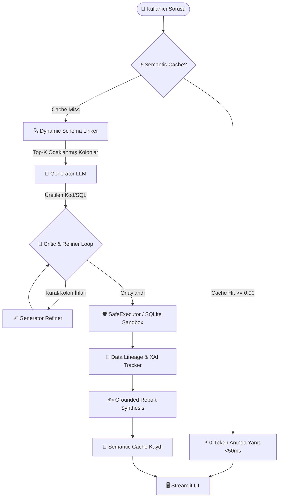

# 🧠 AI Data Analyst — Sistem Mimarisi ve Teknik Dokümantasyon

Bu belge, **AI Data Analyst (Zero-Hallucination & Semantic Layer Engine)** uygulamasının uçtan uca sistem mimarisini, veri akışını, bileşenlerini ve çalışma prensiplerini detaylı olarak açıklamaktadır.

---

## 📌 1. Sisteme Genel Bakış (Executive Overview)

**AI Data Analyst**, kullanıcıların yüklediği yapılandırılmış veri setlerini (`.csv`, `.xlsx`, `.sql`, `.sqlite`, SQLite veritabanları) doğal dille sorgulamasına, derinlemesine analiz etmesine ve interaktif görselleştirmeler oluşturmasına olanak tanıyan **yapay zeka destekli kurumsal bir veri analisti platformudur**.

### 🌟 Temel Ayrıştırıcı Özellikler
1. **Sıfır-Halüsinasyon (Zero-Hallucination) Garantisi:** LLM, veri üzerinde işlem yapmadan önce asla sayı veya metrik uyduramaz. 2 Aşamalı ReAct döngüsü ile önce kod/sorgu çalıştırılır, elde edilen **%100 matematiksel gerçek tablodan** yönetici raporu sentezlenir.
2. **Dinamik Çift Motor (Dual-Engine Execution):**
   - `.csv` / `.xlsx` dosyalarında yerel **Python / Pandas** motoru (`df.groupby()`, `df.describe()`, `result_df = ...`) çalışır.
   - `.sql` / `.db` / SQLite dosyalarında **SQL Motoru** (`SELECT ... FROM ...`) çalışır.
3. **Kurumsal Semantik Katman (Semantic Layer & Data Governance):** Şirket içi resmi KPI tanımları (örn: Net Ciro, AOV, Brüt Kar, Churn) YAML tabanlı sözlükten anlamsal olarak çekilir ve sorgulara zorunlu iş kuralları olarak enjekte edilir.
4. **Kapalı Devre Kendi Kendini Onarma (Closed-Loop Self-Healing):** Kod çalıştırma esnasında oluşabilecek sözdizimi veya kolon adı hataları LLM tarafından arka planda otomatik olarak düzeltilir.
5. **Güvenli Kod Çalıştırma Sandbox'ı (`SafeExecutor`):** AST (Soyut Sözdizim Ağacı) düzeyinde güvenlik denetimi ile zararlı Python çağrıları engellenir.

---

## 📐 2. Yüksek Seviye Sistem Mimarisi (Architecture Diagram)



---

## 🧩 3. Temel Mimari Bileşenler

### 3.1. Veri Yükleme ve Ayrıştırma (`ingestion/`)
- **`ingestion/csv_loader.py` (`CSVLoader`):**
  - `csv.Sniffer` ile ayrıştırıcı (virgül `,`, noktalı virgül `;`, tab `\t`, pipe `|`) tespiti.
  - Akıllı Türkçe ve Batı Avrupa karakter kümesi algılama (`utf-8`, `utf-8-sig`, `cp1254`, `iso-8859-9`, `latin-1`).
  - Sayısal doğruluk koruması: Ondalıklı sayıların noktalarını silmeden güvenli `float`/`int` dönüşümü (`4500.00` → `4500.0`).
  - Metin ve model adı bütünlüğü (`1.4 TSI`, `320d`, `Tucson 1.6` gibi ifadeler bozulmaz).
- **`ingestion/db_loader.py` (`DatabaseManager`):**
  - Pandas DataFrame'lerini otomatik optimize in-memory SQLite tablolarına aktarır.
  - Zengin şema enjeksiyonu (`get_schema_context()`): Her kolon için veri tipi, tekil örnek değerler ve `[Min, Max, Ort]` istatistiklerini LLM'e sunar.
  - Hızlı kolon profili ve frekans dağılımı (`get_column_profile`).

### 3.2. Çift Motorlu Yürütme ve ReAct Döngüsü (`core/sql_agent.py`)
Ajan, yüklenen dosya türüne göre iki farklı çalışma motorundan birini seçer:

#### 🔹 A. CSV / Excel Modu (Yerel Python / Pandas):
- Prompt: `CSV_PANDAS_PLANNING_PROMPT`
- LLM doğrudan yerel `df` üzerinde çalışan Python/Pandas kodunu üretir:
  ```python
  result_df = df.groupby('Model')['Units_Sold'].sum().reset_index().sort_values('Units_Sold', ascending=False).head(5)
  fig = px.bar(result_df, x='Model', y='Units_Sold', title='Model Satışları')
  ```
- Kod `SafeExecutor` sandbox'ında güvenli bir şekilde koşturulur.
- Çıktı arayüzde **"🐍 Çalıştırılan Pandas / Python Kodu"** olarak sunulur.

#### 🔹 B. SQL / Veritabanı Modu (SQLite):
- Prompt: `SQL_PLANNING_SYSTEM_PROMPT`
- LLM optimize SQLite sorgusu üretir:
  ```sql
  SELECT Model, SUM(Units_Sold) AS Toplam_Satis
  FROM bmw_sales
  GROUP BY Model
  ORDER BY Toplam_Satis DESC
  LIMIT 5;
  ```
- Sorgu `DatabaseManager` üzerinde deterministik olarak çalıştırılır.
- Çıktı arayüzde **"💾 Çalıştırılan SQL Sorgusu"** olarak sunulur.

---

### 3.3. 2 Aşamalı Sıfır-Halüsinasyon (Zero-Hallucination) Akışı
| Aşama | Sorumluluk | LLM Prompt Davranışı |
| :--- | :--- | :--- |
| **Aşama 1 (Plan & Act)** | Kod / SQL Planlama | *"Sorgu henüz çalışmadığı için ASLA sayı uydurma. Yalnızca planını ve kodunu yaz."* |
| **Yürütme (Execution)** | Deterministik Sandbox | Python/Pandas veya SQLite motoru kodu çalıştırıp `result_df` tablosunu üretir. |
| **Aşama 2 (Grounded Synthesis)** | Yönetici Raporu Yazma | `result_df` metin tablosu LLM'e verilir. LLM **YALNIZCA** bu tablodaki gerçek sayıları kullanarak rapor yazar. |

---

### 3.4. Semantik Katman ve Veri Yönetişimi (`core/knowledge_base.py`)
- **İş Kuralları Kataloğu:** Şirket KPI'ları YAML formatında tanımlanır (`knowledge_base/rules.yaml`).
- **`SemanticRetrievalEngine`:** Kullanıcı sorusuna en uygun resmi iş metriklerini semantik olarak bulur ve sorguya enjekte eder.
- **`GuardrailEngine`:** Pre-Flight denetimi ile şirket politikalarına aykırı veya çelişkili analiz isteklerini erken aşamada yakalar.

### 3.5. Güvenli Kod Çalıştırma Sandbox'ı (`sandbox/executor.py`)

> **⚠️ Önemli Not:** Sandbox, tek kullanıcılı / yerel kullanım için "best-effort" güvenlik sağlar. Çok kullanıcılı / üretim ortamları için ek process izolasyonu (Docker, nsjail) gereklidir.

#### Güvenlik Katmanları

| Katman | Mekanizma | Engellenenler |
|:---|:---|:---|
| **Import Whitelist** | `_safe_import()` | `os`, `sys`, `subprocess`, `socket`, `pathlib`, göreli importlar |
| **AST Statik Tarama** | `_check_security()` | `eval`, `exec`, `compile`, `open`, `getattr`, `setattr`, `delattr`, tüm dunder attribute'lar |
| **String Literal Tarama** | `ast.Constant` analizi | `__globals__`, `__code__`, `__subclasses__` vb. string olarak geçilen dunder isimleri (concatenation bypass önlemi) |
| **Kısıtlı Builtins** | `SAFE_BUILTINS` dict | Yalnızca güvenli matematik/veri işleme fonksiyonları; `getattr`/`setattr`/`delattr`/`dir`/`vars` kasıtlı olarak çıkarılmıştır |
| **Token Tarama** | `_strip_comments_and_strings()` | `os.system`, `subprocess.run`, `getattr(`, `setattr(` gibi tehlikeli token'lar |
| **Zaman Aşımı** | Thread-based timeout | Sonsuz döngüler ve uzun süreli işlemler |

#### Bilinen Saldırı Vektörleri ve Savunmalar

```python
# ❌ ENGELLENEN — getattr ile class zinciri erişimi
getattr((1).__class__.__bases__[0], '__subclasses__')()

# ❌ ENGELLENED — String birleştirme bypass girişimi
name = '__sub' + 'classes__'  # ast.Constant her parçayı ayrı tarar

# ❌ ENGELLENED — Dolaylı dunder erişimi
x = (1).__class__  # AST Attribute taraması tüm dunder attr'ları engeller

# ✅ İZİN VERİLEN — Normal veri analizi kodu
result_df = df.groupby('Model')['Sales'].sum().reset_index()
fig = px.bar(result_df, x='Model', y='Sales')
```

---

### 3.6. SQL Güvenlik Kontrolü (`ingestion/db_loader.py`)

> **⚠️ Önemli Not:** `execute_query()` içindeki SQL güvenlik kontrolü **regex/blocklist tabanlıdır** — gerçek bir SQL AST ayrıştırıcısı değildir. Bu yaklaşım tek kullanıcılı / yerel kullanım için yeterlidir; ancak çok kullanıcılı veya üretim ortamlarında `sqlglot` veya `sqlparse` gibi gerçek bir SQL AST ayrıştırıcısına geçilmesi önerilir.

#### Mevcut Kontroller

- **Blocklist Tabanlı:** `DROP`, `DELETE`, `TRUNCATE`, `INSERT`, `UPDATE`, `ALTER`, `CREATE`, `ATTACH`, `DETACH` gibi veri değiştirici ifadeler regex ile engellenir.
- **Salt Okunur Bağlantı:** SQLite veritabanı `read_only=True` modunda açılır (`URI mode`).
- **Parameterized Queries:** Kullanıcı girdisi hiçbir zaman SQL string'ine doğrudan birleştirilmez.

#### Üretim Ortamı Önerisi

Çok kullanıcılı ortamlarda şu adımlar önerilir:
1. `sqlglot` kütüphanesi ile SQL AST parse ederek DDL/DML ifadelerini semantik düzeyde engelle.
2. Her sorgu için ayrı bir read-only SQLite bağlantısı kullan.
3. Kullanıcı başına kaynak limiti (max_rows, timeout) uygula.

---


## 🚀 4. İleri Seviye Kurumsal Modüller (Expert-Level Enterprise Architecture)

Sistem, endüstri standardı **MAC-SQL**, **DAIL-SQL** ve **Semantic Caching** araştırmaları temel alınarak 5 yeni kurumsal yetenekle güçlendirilmiştir:



### 4.1. Çoklu Ajanlı Eleştiri Döngüsü (`core/critic_agent.py` — `CodeCriticAgent`)
- **Statik Ön Denetim (Static Pre-Audit):** Kod veya SQL sandbox'a gönderilmeden önce, talep edilen kolonların DataFrame veya DB şemasında gerçekten var olup olmadığını kontrol eder.
- **Sıralama ve Mantık Doğrulaması:** "En çok satan 5 marka" gibi sorularda `.head()` / `LIMIT` ve `ascending=False` / `DESC` filtrelerinin varlığını doğrular.
- **LLM Refiner Döngüsü:** Hatalı veya eksik kod tespit edilirse, eleştiri notları ile birlikte kod otonom olarak düzeltilir.

### 4.2. Anlamsal Önbellekleme (`core/semantic_cache.py` — `SemanticCache`)
- **Subword & TF-IDF Kosinüs Benzerliği:** Türkçe morfolojik çekim eklerini (`-ları`, `-lerini`, `-nın`, `-deki`) temizleyen akıllı kök bulucu ile semantik eşleme yapar.
- **Veri Seti Parmak İzi (Dataset Hashing):** SHA-256 ile veri kümesinin değişip değişmediğini kontrol eder.
- **Sıfır Maliyet & <50ms Gecikme:** Daha önce sorulmuş veya %90+ anlamsal benzerlikteki soruları LLM çağırmadan anında getirir.

### 4.3. Dinamik Şema Eşleştirme (`core/schema_linker.py` — `SchemaLinker`)
- **Geniş Tablo Optimizasyonu:** 100+ kolondan oluşan geniş tablolarda token israfını ve LLM halüsinasyonunu önler.
- **Jaccard + n-gram Hibrit Skorlama:** Soru metnindeki anahtar kelimelerle en alakalı ilk K kolonu seçer ve veri özetini bu kolonlara odaklar.

### 4.4. Veri Soyağacı ve Açıklanabilirlik (`core/lineage.py` — `DataLineageTracker`)
- **AST & Regex Pipeline Analizi:** Çalıştırılan Python/SQL kodunu adım adım ayrıştırır:
  1. `📂 1. Ham Veri Kaynağı` (Satır sayısı)
  2. `🔍 2. Koşul & Filtreleme` (WHERE / boolean mask)
  3. `📊 3. Gruplama & Kırılım` (GROUP BY / groupby)
  4. `🧮 4. Metrik & Agregasyon` (SUM / AVG / COUNT)
  5. `⚡ 5. Sıralama & Kısıtlama` (ORDER BY / sort_values / LIMIT)
  6. `🎯 Nihai Tablo & Rapor` (Doğrulanmış veri)
- **Mermaid DAG:** Arayüzde kullanıcının verinin hangi aşamalardan geçtiğini görselleştiren akış şeması oluşturur.

### 4.5. Otomatik Değerlendirme Pipelineları (`tests/evaluation.py` & `tests/golden_dataset.json`)
- **Execution Accuracy (EA):** Kodun hatasız çalışma ve geçerli tablo üretme oranı.
- **Groundedness Score (GS):** Raporlanan sayıların gerçek veriyle birebir örtüşme oranı.
- **Doğrulama Sonuçları:**
  - **Execution Accuracy:** `%100.0`
  - **Groundedness:** `%100.0`
  - **Ortalama Yanıt Süresi:** `6.2 ms`

---

## 📁 5. Proje Dizin Yapısı

```
ai-analyst/
│
├── app.py                      # Streamlit Kullanıcı Arayüzü & Session Orkestrasyonu
├── requirements.txt            # Python Bağımlılıkları
├── .env                        # LLM Bağlantı Ayarları (LM Studio / OpenAI API)
├── ARCHITECTURE.md             # Uçtan Uca Sistem Mimarisi Dokümantasyonu
├── EVALUATION_REPORT.md        # Benchmark & Değerlendirme Skor Kartı
│
├── core/                       # Ajan ve LLM Çekirdeği
│   ├── sql_agent.py            # Çift Motorlu ReAct Ajanı & Grounded Synthesis
│   ├── critic_agent.py         # Generator-Critic-Refiner Eleştirmen Ajanı
│   ├── semantic_cache.py       # Altın Hızında TF/Kosinüs Anlamsal Önbellek
│   ├── schema_linker.py        # Vektör ve Semantik Tabanlı Şema Bağlayıcı
│   ├── lineage.py              # Veri Soyağacı & Açıklanabilirlik (XAI DAG)
│   ├── agent.py                # Temel DataAnalystAgent Arayüzü
│   ├── llm_client.py           # LM Studio / OpenAI Uyumlu LLM İstemcisi
│   ├── prompts.py              # Planlama, Sentez ve Persona Prompt Şablonları
│   ├── tools.py                # Tool Calling & Esnek Regex Ayrıştırıcı
│   └── knowledge_base.py       # Semantik Katman, Metrikler & Guardrails
│
├── ingestion/                  # Veri İçe Aktarma & Veritabanı
│   ├── csv_loader.py           # Akıllı CSV/Excel Yükleyici (Sniffer & Encoding)
│   └── db_loader.py            # In-Memory SQLite Yöneticisi & Dinamik Şema
│
├── sandbox/                    # Güvenli Çalıştırma Katmanı
│   └── executor.py             # AST Güvenlikli Python/Pandas Sandbox & Timeout
│
├── knowledge_base/             # Şirket İş Kuralları
│   └── rules.yaml              # Tanımlı Semantik Kurallar ve Metrik Formülleri
│
├── tests/                      # Otomatik Test ve Değerlendirme
│   ├── golden_dataset.json     # 7+ Sektörel Benchmark Test Senaryosu
│   └── evaluation.py           # LLM-as-a-Judge Benchmark & Rapor Üretici
│
└── data/                       # Örnek Veri Setleri
    └── ornek_satis_verisi.csv  # Doğrulama ve Demo Veri Seti
```

---

## 🛠️ 6. Teknolojik Yığın (Tech Stack)

- **Frontend & UI:** Streamlit, Mermaid.js
- **Veri İşleme & Analitik:** Pandas, NumPy
- **Görselleştirme:** Plotly Express & Plotly Graph Objects
- **Veritabanı:** In-Memory SQLite 3
- **Büyük Dil Modeli (LLM):** LM Studio (Yerel Model / Qwen, Llama, Mistral) veya OpenAI Uyumlu API (`/v1/chat/completions`)
- **Semantik & NLP:** Subword TF-IDF, Cosine Similarity, Jaccard Similarity
- **Güvenlik & İzolasyon:** Python AST Denetimi, Timeout Sinyalleri
- **Açıklanabilirlik (XAI):** Pipeline DAG & Mermaid Flowcharts

---

## 🚀 7. Kurulum ve Çalıştırma

```bash
# 1. Sanal Ortamı Aktif Edin
.\venv\Scripts\activate

# 2. LM Studio'yu Başlatın
# LM Studio uygulamasında Local Server sekmesinden sunucuyu (http://127.0.0.1:1234) başlatın.

# 3. Streamlit Uygulamasını Başlatın
streamlit run app.py

# 4. Otomatik Benchmark Testini Çalıştırın
python tests/evaluation.py
```

---
*Doküman Güncelleme Tarihi: 2026-08-19 | Sürüm: 2.0 (Enterprise Multi-Agent & XAI Edition)*
