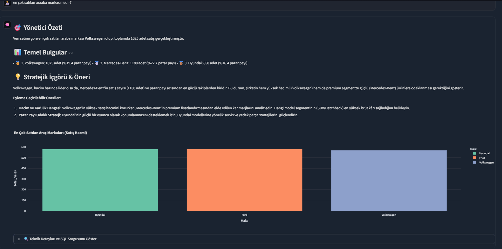

# 🧠 AI Data Analyst — Text-to-SQL, Enterprise Semantic Layer & ReAct Platform

<p align="center">
  
</p>

Yerel LLM (LM Studio / llama.cpp) destekli, **Deterministik Text-to-SQL**, **Kurumsal Semantik Katman (Semantic Layer / Metric Store)**, **Otomatik Veri Sağlık Raporu (Data Profiling)**, **Dinamik Niyet Yönlendirme (Intent Router)**, **Pre-Flight Guardrail (Koruma Katmanı)**, **ReAct Tool Calling**, **SQLite Veritabanı** ve **Plotly Görselleştirme** motoruna sahip yeni nesil veri analisti platformu.

---

## 🏛️ Mimari ve Öne Çıkan Özellikler

- **🏛️ Deterministic Execution over Generative Guessing:** Ham Pandas kodu yerine deterministik SQLite motoru üzerinde salt-okunur (read-only) SQL sorguları ile sıfır halüsinasyon.
- **🛡️ Enterprise Semantic Layer (Metric Store):** Şirketin resmi metrik tanımları (Resmi Ad, Eş Anlamlılar, İş Tanımı, Teknik SQL Formülü, Sürüm, Sorumlu Departman ve Zorunlu Koşullar) tek bir doğru kaynak (Single Source of Truth) olarak tutulur.
- **🔍 Hybrid Retrieval Engine & Query Caching:** Context Flooding'i önlemek için anahtar kelimeleri ve anlamsal kök/niyet eşleşmesini (Semantic Intent) birleştiren, önbellek destekli dinamik kural çağırıcı.
- **⚡ Pre-Flight Guardrail Validation:** Kurumsal standartlara aykırı sorguları (örn: iptal edilmiş işlemlerin cirosunu istemek) LLM'e gitmeden önce sıfır token maliyetiyle tespit edip erken yönetişim uyarısı dönen koruma katmanı.
- **📜 Lifecycle Management & Versioning:** `version` (v1.2), `owner` (Finans/Pazarlama) ve `is_active` (soft-deprecation) meta-verileri ile kurumsal sürümleme ve denetim izi.
- **🔄 ReAct Tool Calling:** Adım adım analiz:
  1. `Semantic Retrieve & Pre-Flight Check`
  2. `Reason` (Soru analizi ve SQL planlama)
  3. `execute_sql` (SQLite üzerinde sorgu çalıştırma)
  4. `generate_python_plot` (Temiz `result_df` üzerinde Plotly görselleştirmesi)
  5. `Observe & Conclude` (Data Governance Kartı ile şeffaf iş analizi)
- **🩹 Closed-Loop Self-Healing:** SQL veya Python hatalarında otonom olarak LLM'e negatif geri bildirim ileterek hatayı düzeltme.
- **💻 %100 Yerel ve Gizli:** Verileriniz asla internete veya üçüncü parti sunuculara iletilmez.

---

## 🚀 Hızlı Başlangıç

### 1. Kurulum
```bash
# Sanal ortam oluşturma ve etkinleştirme
python -m venv venv
venv\Scripts\activate      # Windows için

# Bağımlılıkların yüklenmesi
pip install -r requirements.txt
```

### 2. Yerel LLM Sunucusunun Başlatılması (llama-server)
```bash
llama-server -m models/model.gguf --port 8080 -ngl 99 -c 8192
```

### 3. Uygulamanın Başlatılması
```bash
streamlit run app.py
```

---

## 📁 Proje Yapısı

```
ai-analyst/
├── app.py                    # Streamlit UI, Canlı ReAct (st.status) & Data Governance Kartı
├── requirements.txt          # Python Bağımlılıkları
├── .env                      # LLM Bağlantı Ayarları
├── PORTFOLIO_NOTES.md        # CV, Mülakat ve 8 Temel Mimari Savunma Rehberi
├── core/
│   ├── sql_agent.py          # SQLReActAgent Orkestratörü & Pre-Flight Entegrasyonu
│   ├── knowledge_base.py     # Semantic Layer, Hybrid Retriever, Guardrail & Caching
│   ├── tools.py              # Tool Tanımları (execute_sql, generate_python_plot)
│   ├── prompts.py            # Hard-Constraint Semantic Promptları
│   ├── llm_client.py         # OpenAI Uyumlu Yerel LLM İstemcisi
│   └── history.py            # JSON Tabanlı Oturum Yöneticisi
├── ingestion/
│   ├── db_loader.py          # SQLite Veritabanı Yöneticisi & Şema Enjeksiyonu
│   └── csv_loader.py         # CSV/Excel Yükleyici & Encoding Algılayıcı
├── sandbox/
│   └── executor.py           # AST Güvenlikli Python & Plotly Sandbox'ı
└── data/
    ├── business_glossary.json # Versiyonlu Kurumsal İş Kuralları Sözlüğü
    └── sessions/             # Kayıtlı Sohbet Oturumları
```

---

## 🎓 Teknik ve Akademik Referanslar
Detaylı teknik mimari kararlar, mülakat soru-cevapları ve CV maddeleri için [PORTFOLIO_NOTES.md](file:///c:/Users/ASUS/Documents/ai-analyst/PORTFOLIO_NOTES.md) dosyasını inceleyebilirsiniz.
