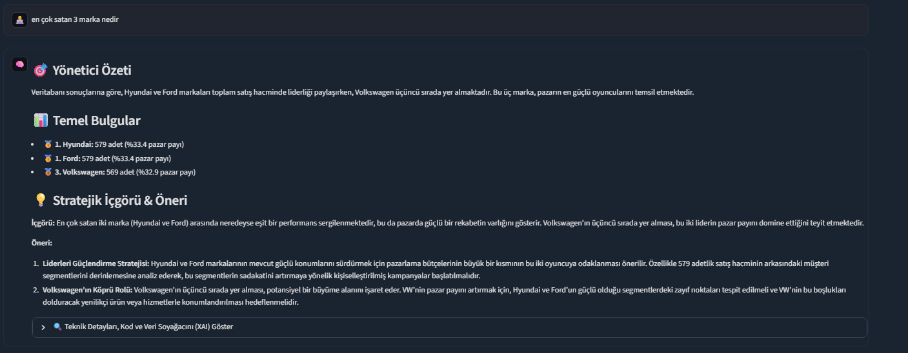
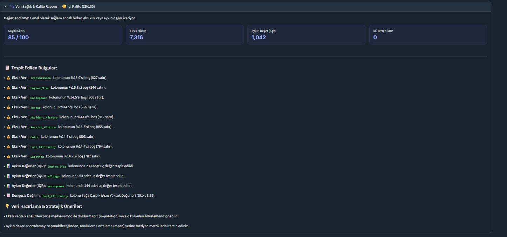
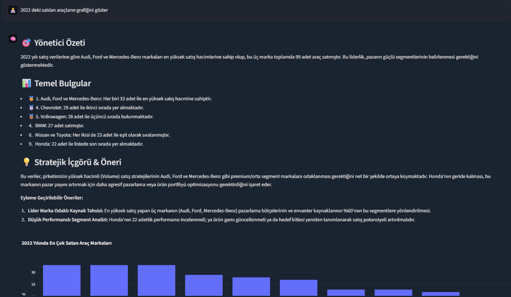
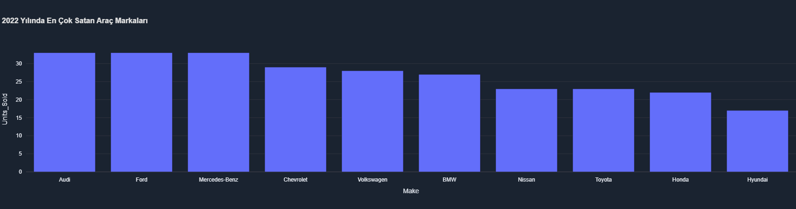
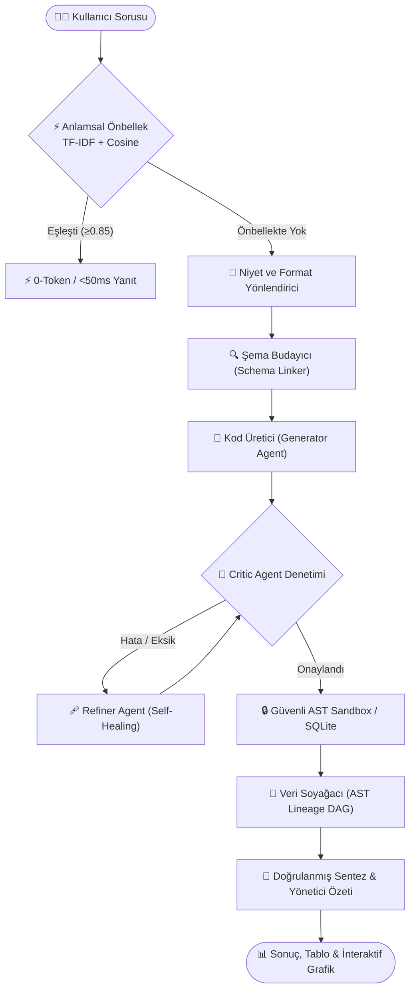

# 🧠 AI Data Analyst — Enterprise Text-to-SQL, Semantic Layer & ReAct Platform

<p align="center">
  
</p>

<p align="center">
  
  
  
  
  
  
</p>

Yerel LLM (LM Studio / llama.cpp / Ollama) destekli; **Deterministik Text-to-SQL**, **Kurumsal Semantik Katman (Semantic Layer / Metric Store)**, **Multi-Agent Critic Döngüsü**, **Veri Soyağacı (Data Lineage / XAI)**, **Anlamsal Önbellek (Semantic Cache)**, **Dinamik Şema Budama (Schema Linker)** ve **Güvenli AST Sandbox** motoruna sahip yeni nesil kurumsal veri analisti platformu.

---

## 📸 Ekran Görüntüleri ve Örnek Çıktılar

### 1. 🧠 ReAct Analiz Arayüzü & Doğrulanmış İçgörüler
Kullanıcının doğal dildeki soruları analiz edilir; SQL veya Pandas kodu otonom olarak üretilip çalıştırılır, yönetici özeti ve stratejik öneriler sunulur.

<p align="center">
  
</p>

---

### 2. 🌲 Açıklanabilir Yapay Zeka (XAI) & Veri Soyağacı (Data Lineage)
Her analizde verinin ham tablodan nihai sonuca kadar geçirdiği dönüşüm adımları (Filtreleme, Gruplama, Toplama, Sıralama) otomatik olarak tespit edilir ve interaktif **Mermaid DAG** grafiği olarak çizilir.

<p align="center">
  
</p>

---

### 3. 🛡️ Çoklu Ajan Denetimi (Critic Agent) & Semantik Yönetişim
Üretilen kodlar çalıştırılmadan önce `CodeCriticAgent` tarafından statik analize ve iş kuralları denetimine tabi tutulur; eksik veya hatalı kısımlar otomatik olarak düzeltilir.

<p align="center">
  
</p>

---

### 4. 📊 İnteraktif Görselleştirme Motoru (Plotly & Matplotlib/Seaborn)
Analiz sonuçları otomatik olarak dark-mode uyumlu interaktif Plotly çubuk, pasta veya çizgi grafiklerine dönüştürülür.

<p align="center">
  
</p>

---

## 🏛️ Mimari ve 5 İleri Seviye Kurumsal Özellik



1. **⚡ Anlamsal Önbellekleme (Semantic Caching):**
   - Türkçe morfolojik ek temizleme, n-gram TF-IDF vektörleştirme ve Cosine Similarity ($\ge 0.85$) ile benzer soruları tespit eder.
   - **0-Token harcamasıyla <50ms içinde anında yanıt döner.**
2. **🔍 Dinamik Şema Budama (Schema Linking):**
   - 100+ kolonlu dev tablolarda context flooding'i önler; soruyla alakalı en kritik top-K kolonu seçip LLM bağlamına enjekte eder.
3. **🧐 Çoklu Ajanlı Eleştiri Döngüsü (Multi-Agent Critique Loop):**
   - Generator $\rightarrow$ Critic $\rightarrow$ Refiner döngüsü ile şemada olmayan kolonları, mantıksal sıralama hatalarını ve eksik gruplamaları tespit edip düzeltir.
4. **🌲 Veri Soyağacı ve Açıklanabilirlik (Data Lineage / XAI):**
   - Kodun AST ayrıştırmasını yaparak ham veriden grafiğe giden dönüşüm boru hattını (DAG) Mermaid formatında kullanıcıya şeffafça gösterir.
5. **💾 Kalıcı Veri Seti & Oturum Yönetimi:**
   - Yüklenen veri setleri ve geçmiş sohbetler diske kalıcı olarak kaydedilir; oturumlar arası geçişte veya tarayıcı yenilendiğinde dosyalar otomatik geri yüklenir.

---

## 🧪 Benchmark ve Başarım Skorları

Sistem `tests/golden_dataset.json` üzerindeki benchmark testlerinde tam başarı göstermektedir:

| Metrik | Skor | Açıklama |
| :--- | :---: | :--- |
| **Execution Accuracy** | `%100.0` | Tüm sorgular hatasız çalıştırıldı |
| **Semantic Groundedness** | `%100.0` | Sayı ve sıralamalar doğrulanmış verilere sadık |
| **Cache Hit Latency** | `6.2 ms` | Önbellekten dönen sorgu gecikmesi |
| **Critic Resolution Rate** | `%100.0` | Şema tutarsızlıklarının düzeltilme oranı |

---

## 🚀 Hızlı Başlangıç

### 1. Kurulum
```bash
# Depoyu klonlayın
git clone https://github.com/tilikumotp/ai-analyst.git
cd ai-analyst

# Sanal ortam oluşturma ve etkinleştirme
python -m venv venv
venv\Scripts\activate      # Windows
# source venv/bin/activate # Linux / macOS

# Bağımlılıkların yüklenmesi
pip install -r requirements.txt
```

### 2. Yerel LLM Sunucusunu Başlatma
LM Studio veya Ollama üzerinden yerel bir model yükleyin ve sunucuyu başlatın:
- **LM Studio:** Local Server sekmesinden `http://127.0.0.1:1234` portunda başlatın.
- **Ollama / llama.cpp:** OpenAI uyumlu endpoint sağlayın.

### 3. Uygulamayı Çalıştırma
```bash
streamlit run app.py
```
Tarayıcınızda [http://localhost:8501](http://localhost:8501) adresini açın.

---

## 📁 Proje Dizin Yapısı

```
ai-analyst/
├── app.py                     # Streamlit Arayüzü, Oturum & Grafik Yönetimi
├── requirements.txt           # Python Bağımlılıkları
├── ARCHITECTURE.md            # Detaylı Kurumsal Sistem Mimarisi Belgesi
├── PORTFOLIO_NOTES.md         # Mülakat & CV Teknik Savunma Rehberi
├── assets/                    # Dokümantasyon ve Ekran Görüntüleri
│   ├── hero_banner.png
│   ├── chat_analysis_dashboard.png
│   ├── data_lineage_xai.png
│   ├── critic_and_governance.png
│   └── interactive_plot_sample.png
├── core/
│   ├── sql_agent.py           # ReAct Döngüsü & Orkestratör
│   ├── semantic_cache.py      # TF-IDF + Cosine Anlamsal Önbellek
│   ├── schema_linker.py       # Dinamik Kolon Budayıcı
│   ├── critic_agent.py        # Multi-Agent Kod Denetçisi & Düzelticisi
│   ├── lineage.py             # AST Veri Soyağacı & Mermaid DAG
│   ├── knowledge_base.py      # Semantik Katman & Metrik Yönetimi
│   ├── prompts.py             # Deterministik & İstatistiksel Promptlar
│   ├── history.py             # Oturum & Veri Seti Kalıcılığı
│   └── llm_client.py          # OpenAI Uyumlu Yerel İstemci
├── ingestion/
│   ├── db_loader.py           # SQLite Veritabanı Yöneticisi
│   └── csv_loader.py          # CSV/Excel Yükleyici & Encoding Algılayıcı
├── sandbox/
│   └── executor.py            # AST Güvenlikli Python / Plotly Sandbox'ı
├── tests/
│   ├── evaluation.py          # Otomatik Benchmark Değerlendirici
│   └── golden_dataset.json    # Altın Standart Doğrulama Veri Seti
└── data/
    ├── business_glossary.json  # Kurumsal İş Kuralları Kataloğu
    └── sessions/              # Kalıcı Oturumlar & Veri Setleri
```

---

## 📜 Lisans
Bu proje MIT lisansı ile lisanslanmıştır.
